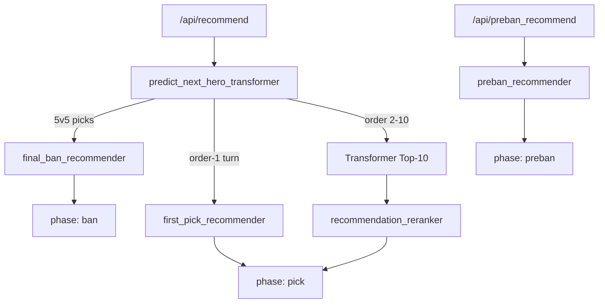

# Draft Recommendation Logic / BP 推荐逻辑

This document describes how **preban**, **first pick (order-1)**, **mid-draft picks (order 2–10)**, and **final ban** recommendations are routed and computed in the backend.

本文说明后端如何分流并计算 **预禁（preban）**、**第一锁（first pick / order-1）**、**中盘选人（order 2–10）** 与 **终 ban（final ban）** 四类推荐。

Related: [README_RECOMMENDER.md](./README_RECOMMENDER.md) (how to run the service / 如何启动服务)

Frontend draft order (UI only, not recommendation logic): `frontend/src/draftLogic.ts`  
前端 BP 顺序（仅 UI，非推荐算法）：`frontend/src/draftLogic.ts`

---

## 1. High-level routing / 总路由

### English

Two HTTP endpoints drive recommendations:

| Endpoint | When used | `phase` in response |
|----------|-----------|---------------------|
| `GET /api/preban_recommend` | While user is filling preban slots | `"preban"` |
| `GET /api/recommend` | After preban, through picks and final ban | `"pick"` or `"ban"` |

Inside `/api/recommend`, `predict_next_hero_transformer()` in `backend/recommender_service.py` branches in this order:

1. **Final ban** — both teams have 5 picks → `final_ban_recommender`
2. **First pick (order-1)** — the first-pick side has zero picks → `first_pick_recommender`
3. **Mid-draft pick** — Transformer softmax Top-10 → optional `recommendation_reranker`

**Bucket 1 (order-1) must never go through the Transformer reranker.** `recommendation_reranker.rerank_candidates()` raises if `position_bucket == "1"`.

### 中文

推荐由两个 HTTP 接口驱动：

| 接口 | 使用时机 | 响应中的 `phase` |
|------|----------|------------------|
| `GET /api/preban_recommend` | 填写预禁阶段 | `"preban"` |
| `GET /api/recommend` | 预禁结束后，选人至终 ban | `"pick"` 或 `"ban"` |

在 `/api/recommend` 内部，`backend/recommender_service.py` 的 `predict_next_hero_transformer()` 按以下顺序分支：

1. **终 ban** — 双方各 5 人 → `final_ban_recommender`
2. **第一锁（order-1）** — 先手方尚未选人 → `first_pick_recommender`
3. **中盘选人** — Transformer softmax Top-10 → 可选 `recommendation_reranker`

**Bucket 1（第一锁）绝不能走 Transformer reranker。** `recommendation_reranker.rerank_candidates()` 在 `position_bucket == "1"` 时会直接报错。



---

## 2. Shared concepts / 共享概念

### English

**Directional prebans (`derive_directional_prebans`)**  
Maps UI `ally_preban` / `enemy_preban` into **first-side** and **second-side** tuples relative to who has first pick in the match. Used by first-pick and final-ban logic so historical rows align with the current draft perspective.

**Unavailable / excluded heroes**  
Heroes already prebanned or picked are removed from all recommendation lists. Computed in `recommender_service.unavailable_heroes_from_draft()`.

**Data sources**  
Most statistical recommenders read from:

- Pickled artifacts under runtime paths (`PREBAN_STATS_PATH`, `FIRST_PICK_RECORDS_PATH`, …), or
- Raw match history JSONL (`epic7_match_history_raw.jsonl`) as fallback

**Android parity**  
Kotlin local handlers mirror the same branches; see `E7_BP_Helper_Android/` and `workflow_scripts/android_recommendation_parity.py`.

### 中文

**方向性预禁（`derive_directional_prebans`）**  
把 UI 的 `ally_preban` / `enemy_preban` 映射为相对「本局先手方」的 **first-side / second-side** 二元组。first pick 与 final ban 用此与历史对局对齐。

**不可用 / 排除英雄**  
已预禁或已选中的英雄不会出现在推荐里。由 `recommender_service.unavailable_heroes_from_draft()` 计算。

**数据来源**  
统计类推荐优先读 pickle artifact，否则回退到原始 JSONL 对局历史。

**Android 对齐**  
Kotlin 本地 API 走相同分支；见 `workflow_scripts/android_recommendation_parity.py`。

---

## 3. Preban / 预禁

| | |
|---|---|
| **Module** | `backend/preban_recommender.py` |
| **API** | `GET /api/preban_recommend` |
| **Handler** | `recommend_prebans()` |

### English

**Purpose:** Suggest heroes to preban based on **historical preban frequency**, not the Transformer model.

**Stats:** Count how often each hero appears in `ally_preban` or `enemy_preban` in JSONL, bucketed by `first_pick_side` (`ally` \| `enemy`).

**Request parameters (typical):**

- `excluded_heroes` — already used in draft
- `preban_side` — `user` → ally-side stats, `enemy` → enemy-side stats, else combined
- `first_pick_team` — scopes stats to the same first-pick context
- `top_k`

**Output:**

- `phase: "preban"`
- `recommendations[]` with `hero_id`, `normalized_preban_rate`, `preban_count`
- `top_10_heroes` / `top_10_rates` (rates ≈ share of all preban mentions in the chosen bucket, sum ≈ 100%)

**Fallback:** If the context-specific bucket is empty, falls back to combined ally+enemy counts (`preban_stats_fallback: true`).

### 中文

**作用：** 按 **历史预禁频率** 推荐预禁目标，不走 Transformer。

**统计：** 在 JSONL 中按 `first_pick_side` 统计各英雄出现在 `ally_preban` / `enemy_preban` 的次数。

**典型参数：** `excluded_heroes`、`preban_side`（我方/敌方/合并）、`first_pick_team`、`top_k`。

**输出：** `phase: "preban"`，`normalized_preban_rate` 为所选桶内占比，Top 列表约加总 100%。

**回退：** 上下文桶无数据时用全局合并统计。

---

## 4. First pick (order-1) / 第一锁

| | |
|---|---|
| **Module** | `backend/first_pick_recommender.py` |
| **Trigger** | `is_first_pick_recommendation_turn()` — first-pick side has 0 picks |
| **Entry** | `recommend_first_pick()` via `first_pick_recommendation()` |
| **Handled by** | `"first_pick_stats"` |

### English

**Purpose:** Recommend the **opening lock (order 1)** from historical matches with similar **directional preban context**. Does **not** use TFLite or the reranker.

**Matching — four fallback levels:**

| Level | Match rule | Level weight |
|-------|------------|--------------|
| 1 | Exact match on both first-side and second-side preban tuples | 1.0 |
| 2 | Exact first-side tuple; weighted second-side overlap ≥ 0.30 | 0.50 |
| 3 | Both sides weighted overlap ≥ 0.30 | 0.25 |
| 4 | Season-wide order-1 counts (baseline) | 0.05 |

Level 3 record weight is multiplied by **weighted directional similarity**  
`0.6 × weighted_first_overlap + 0.4 × weighted_second_overlap`.

Levels 1→3 fill the list; level 4 always appends a small global prior.

**Preban informativeness (info weight)** — soft downweight for “empty bans”:

There is **no binary `is_empty_ban` flag**. Each hero gets `info_weight` from full-record stats:

```text
preban_score     = preban_count[hero] / max_preban_count
first_pick_score = order_1_count[hero] / max_order_1_count
raw_signal       = 0.70 × preban_score + 0.30 × first_pick_score
info_weight      = 0.20 + 0.80 × raw_signal
```

- `preban_count`: appearances in `first_side_preban` + `second_side_preban` (all records)
- `order_1_count`: times hero was order-1 pick
- Unknown heroes default to **0.20**

Weighted overlap uses these weights instead of treating every preban name equally. Low-information bans contribute less to Level 2/3 matching.

**Output:** `phase: "pick"`, `top_10_heroes`, `top_10_rates`, `first_pick_fallback_level`, `handled_by: "first_pick_stats"`.

### 中文

**作用：** 根据 **方向性预禁上下文** 相似的历史对局，推荐 **第一锁（order 1）**。不用 TFLite，也不走 reranker。

**四层 fallback：**

| 层级 | 匹配规则 | 层级权重 |
|------|----------|----------|
| 1 | 双方 preban tuple 完全一致 | 1.0 |
| 2 | 先手 tuple 一致；后手加权 overlap ≥ 0.30 | 0.50 |
| 3 | 双方加权 overlap 均 ≥ 0.30 | 0.25 |
| 4 | 全局 order-1 统计（兜底） | 0.05 |

Level 3 每条记录权重再乘 **加权方向相似度**（0.6 / 0.4）。

**Preban 信息量（info weight）** — 对「空 ban」软降权：

**没有** 硬性的 `is_empty_ban` 判断。从全量 records 统计每个英雄的 `info_weight`（公式见上）。未知英雄默认 **0.20**。低信息量 preban 在 Level 2/3 的加权 overlap 里贡献更小。

**输出：** `phase: "pick"`，`first_pick_fallback_level`，`handled_by: "first_pick_stats"`。

---

## 5. Mid-draft pick (order 2–10) / 中盘选人

| | |
|---|---|
| **Module** | `backend/recommender_service.py` + `backend/recommendation_reranker.py` |
| **Model** | Transformer (`rec_model_position_warfare.weights.h5`) |
| **Trigger** | Not final ban, not first-pick turn |

### English

**Step 1 — Transformer inference**

- Build tensors from current draft, prebans, first pick team, warfare rules
- Run model → hero probability vector
- Mask unavailable heroes and invalid tokens
- Take Top-10 as `top_10_heroes` / `top_10_rates` (softmax × 100 over full hero space; Top-10 usually does not sum to 100%)

**Step 2 — Reranker (optional, `RECOMMENDER_RERANKER=true`)**

- Skipped when `position_bucket == "1"` (first pick handled elsewhere)
- For buckets `2_3`, `4`, `5_protected`, `6_protected`, `7`, `8_9`, `10`, blends:
  - **model** — Transformer score
  - **synergy** — ally-pick synergy stats
  - **response** — counter/response stats vs enemy picks
- Bucket-specific weights in `BUCKET_WEIGHTS` (e.g. `2_3`: 55% model / 15% synergy / 30% response)
- **Low-pick guard** (`RERANKER_LOW_PICK_GUARD`): demotes rare heroes unless model + stats evidence is strong enough

**Output:** `phase: "pick"`, optional `reranker_enabled` / `reranker_applied`.

### 中文

**第一步 — Transformer 推理**

- 根据当前 BP、预禁、先手、阵形规则构造输入
- 模型输出英雄概率，屏蔽已用英雄
- 取 Top-10；`top_10_rates` 为 softmax×100（全英雄空间，Top-10 通常不加总为 100%）

**第二步 — Reranker（可选，`RECOMMENDER_RERANKER=true`）**

- `position_bucket == "1"` 时跳过（第一锁由 `first_pick_recommender` 处理）
- 各 bucket 混合 **model / synergy / response** 三分，`BUCKET_WEIGHTS` 按位置不同
- **Low-pick guard**：低频英雄若无足够统计证据会被降权

**输出：** `phase: "pick"`。

---

## 6. Final ban / 终 ban

| | |
|---|---|
| **Module** | `backend/final_ban_recommender.py` |
| **Trigger** | `len(user_picks) >= 5 and len(enemy_picks) >= 5` |
| **Handled by** | `"final_ban_hybrid_v2"` when labeled stats exist; otherwise `"final_ban_stats_v1"` |

### English

**Purpose:** Rank **enemy picks** the user should ban after both teams lock 5 heroes.

**Candidates:** Up to 4 bannable enemy picks (excludes protected 3rd-lock slot on each side per RTA rules).

**Scoring:** Hybrid blend of real final-ban history and the existing lineup formula.

```text
smoothed_rate = (ban_count + prior_strength × parent_rate)
              / (eligible_count + prior_strength)
confidence = eligible_count / (eligible_count + confidence_strength)
history_weight = max_history_weight × confidence
ban_score = history_weight × historical_score + (1 - history_weight) × formula_score
```

- **Historical score** — layered lookup by actor first/second pick, warfare rule, candidate position bucket, and hero, with fallback to coarser buckets and parent smoothing.
- **Formula score** — unchanged v1 blend:

```text
formula_score = 0.48 × synergy_core
              + 0.40 × ally_lack_response
              + 0.12 × position_threat
```

- **Synergy core** — how strongly the hero synergizes with other enemy locks
- **Ally lack response** — ally team lacks known counters/responses to this hero
- **Position threat** — order-based threat (late picks weighted higher)

Stats sources:
- Historical artifact: `data/runtime/final_ban_stats.pkl` from labeled `ally_final_ban_target` / `enemy_final_ban_target`
- Formula CSVs: `hero_synergy_stats.csv`, `hero_counter_or_response_stats.csv`

**v1 note:** This first hybrid version does **not** use `winner_side`. Re-scrape with `E7_GET_MATCHES_REVISIT=1` to backfill final-ban labels before history becomes the primary signal.

**Output:** `phase: "ban"`, ranked enemy heroes, hybrid debug fields (`historical_ban_rate`, `formula_score`, `historical_weight`, ...), and `top_10_rates` as **display priority** among ban candidates (sharpened, ~100% among shown targets).

**Frontend:** User selects one enemy hero as ban target; UI shows ban overlay on team panel (`selectedBanCode`).

### 中文

**作用：** 双方各 5 人后，对 **敌方已选英雄** 做终 ban 排序。

**候选：** 最多 4 个可 ban 的敌方 pick（不含双方受保护的第 3 锁）。

**评分：** 真实终 ban 历史频率为主、阵容统计公式为辅的混合评分（见上公式）。有足够 labeled 数据时 `handled_by = final_ban_hybrid_v2`；否则自动回退纯公式 `final_ban_stats_v1`。

**输出：** `phase: "ban"`，`top_10_rates` 为展示用相对优先级（非模型 softmax）。

**前端：** 用户点选终 ban 目标；选人面板显示 ban 标记。

---

## 7. Code index / 代码索引

| Phase / 阶段 | File / 文件 | Key functions / 关键函数 |
|--------------|-------------|-------------------------|
| Routing / 路由 | `backend/recommender_service.py` | `predict_next_hero_transformer`, `first_pick_recommendation`, `final_ban_recommendation`, `maybe_rerank_transformer_recommendations` |
| Preban / 预禁 | `backend/preban_recommender.py` | `recommend_prebans`, `resolve_preban_first_pick_side` |
| First pick / 第一锁 | `backend/first_pick_recommender.py` | `recommend_first_pick`, `build_first_pick_info_weights`, `weighted_preban_overlap`, `directional_match_level` |
| Pick rerank / 中盘重排 | `backend/recommendation_reranker.py` | `rerank_candidates`, `bucket_weights`, `apply_low_pick_top3_guard` |
| Final ban / 终 ban | `backend/final_ban_recommender.py` | `recommend_final_bans`, `recommend_final_bans_from_lists` |
| UI draft order / 前端 BP | `frontend/src/draftLogic.ts` | `PREBAN_ORDER`, `PICK_ORDER_PATTERN`, `getPickTeam` |

---

## 8. Response `phase` summary / 响应 phase 对照

| `phase` | Meaning / 含义 | Engine / 引擎 |
|---------|----------------|---------------|
| `preban` | Preban suggestions / 预禁推荐 | Historical preban counts / 预禁频率统计 |
| `pick` | Next lock during draft / 选人阶段下一手 | First-pick stats **or** Transformer (+ reranker) |
| `ban` | Final ban target ranking / 终 ban 排序 | Final-ban stats / 终 ban 统计 |

---

## 9. What not to mix up / 易混淆点

### English

1. **Preban API ≠ pick API** — preban uses `/api/preban_recommend` only during the 4 preban slots.
2. **First pick ≠ bucket-1 reranker** — order-1 is `first_pick_recommender`; reranker explicitly rejects bucket `"1"`.
3. **First-pick rates vs Transformer rates** — first pick: weighted historical counts; Transformer: next-step softmax.
4. **Final-ban rates vs pick rates** — ban rates are relative ban priority among enemy picks, not pick probability.
5. **Empty ban** — no hard label; first pick uses **info_weight ≈ 0.20** and weighted overlap threshold **0.30**.

### 中文

1. **预禁接口 ≠ 选人接口** — 预禁只走 `/api/preban_recommend`。
2. **第一锁 ≠ bucket-1 reranker** — order-1 只走 `first_pick_recommender`。
3. **第一锁百分比 ≠ Transformer 百分比** — 前者是历史加权计数，后者是下一步 softmax。
4. **终 ban 百分比 ≠ 选人百分比** — ban 率是敌方目标间的相对优先级。
5. **空 ban** — 无硬标签；靠 info_weight 与加权 overlap 软处理。

---

*Last updated to reflect first-pick info-weight weighting (Phase 1). / 已包含第一锁 info-weight 第一阶段改造。*
